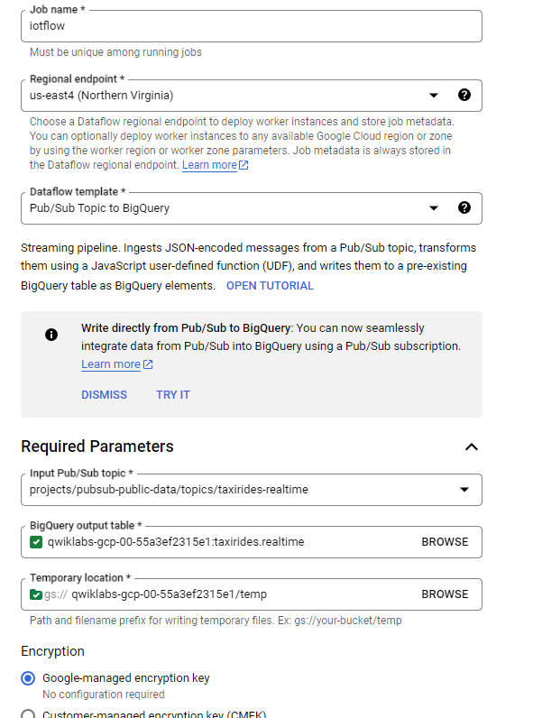

## Task 1 Create a Cloud BigQuery dataset and table Using Cloud Shell

import datasets `taxiriders`
```
bq mk taxirides
```

create `table` in Bigquery
```
bq mk \
--time_partitioning_field timestamp \
--schema ride_id:string,point_idx:integer,latitude:float,longitude:float,\
timestamp:timestamp,meter_reading:float,meter_increment:float,ride_status:string,\
passenger_count:integer -t taxirides.realtime
```

create a storage bucket #❓ what is the bucket acually mean?
```
export BUCKET_NAME=qwiklabs-gcp-00-55a3ef2315e1
```

```
gsutil mb gs://$BUCKET_NAME/
```
![[attachments/2023-06-15-11.png]]
## Task 2 DataFlow Run the pipeline


after this run you will see your table `realtime` in BigQuery and you can send SQL to query data
![[attachments/2023-06-15-13.png]]


