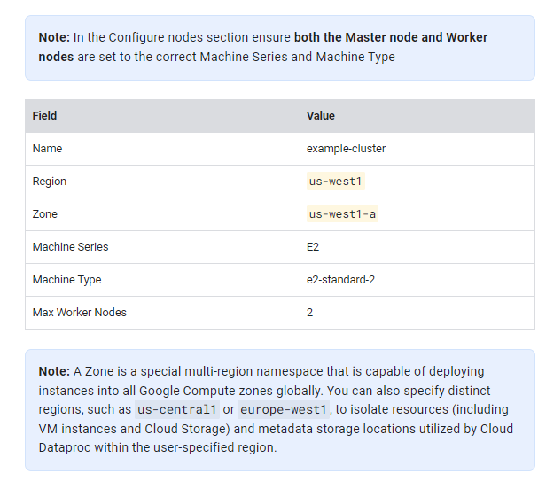
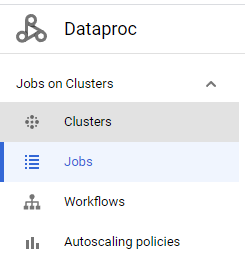
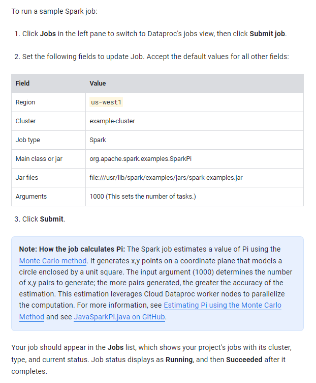

## Task 1. Create a cluster

1.  In the Cloud Platform Console, select **Navigation menu** > **Dataproc** > **Clusters**, then click **Create cluster**.
2.  Click **Create** for **Cluster on Compute Engine**.
3.  Set the following fields for your cluster and accept the default values for all other fields:

## Task 2. Submit a job

## Task 3. View the job output
![][attachments/2023-06-15-6.png]

![][attachments/2023-06-15-7.png]
![][attachments/2023-06-15-8.png]
#❓ what `job` run acually do ?

![][attachments/2023-06-15-9.png]

1 cluster can run multi jobs
![][attachments/2023-06-15-10.png]
